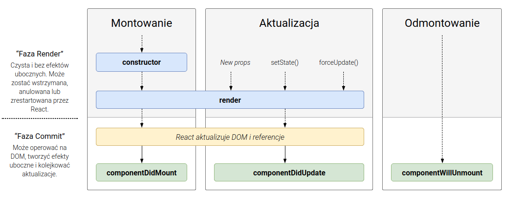

class: center, middle, inverse

# Projektowanie graficznych interfejsów użytkownika
## Robert Szmurło
e-mail: robert.szmurlo@ee.pw.edu.pl
2018Z

---

# Plan wykładu

* Front-end development model
* Wprowadzenie do React
* Prosta, klasyczna aplikacja z wykorzystaniem React (moze saper?) z wykorzystaniem `<button>`
* Aplikacja wykorzystująca canvas

.img-center-xsmall[
]
---

# Wprowadzenie do React

* Co to jest React? - To deklaratywna, efektywna oraz uniwersalna biblioteka w
  JavaScript do budowania interfejsu użytkownika.
* Wszystko jest komponentem
  Komponent, w ogólności to wszystko co wygląda jak:
  ```html
  <UppercaseTag>
  ```
 * Komponenty można zagnieżdżać.
 * Komponenty powinny być 'odizolowane' (ang. isolated) - maksymalnie skupione,
  powinny zawierać pełną funkcjonalność, być niezależne od elmentów zewnętrznych

 * React przechowuje cały DOM aplikacji w pamięci, po zmianie stanu wyszukuje
   różnice między wirtualnym i prawdziwym DOM i aktualizuje zmiany.
---

# Komponenty

A component takes in parameters, called props (short for “properties”),
and returns a hierarchy of views to display via the render method.

The render method returns a description of what you want to see on the screen.

```JavaScript
class HelloWorld extends React.Component {
  render() {
    return <p>Hello World</p>;
  }
}

function App() {
  return <HelloWorld where="Świecie" />;
}

const rootElement = document.getElementById("root");
ReactDOM.render(<App />, rootElement);
```

Komponent zasadniczo jest funkcją, która zwraca co ma costać wyświetlone w DOM.
---
# Co robi React 'pod pokładem'

The render method returns a description of what you want to see on the screen.
React takes the description and displays the result.
In particular, render returns a React element, which is a lightweight
description of what to render. Most React developers use a special syntax
called “JSX” which makes these structures easier to write.
The `<div />` syntax is transformed at build time to
`React.createElement('div')`.

```html
<p>Hello World (where? {this.props.where})</p>
```

zostanie przetransformowane do:

```JavaScript
React.createElement(
  "p",
  null,
  "Hello World (where? ",
  this.props.where,
  ")"
);
```
---

# Cztery sposoby / style tworzenia komponetów

* Domyślny: Component Class
* Komponent starego typu: createClass
* Komponent typu: The Stateless Function
* Komponent prezentacji: The Presentational Component

.smaller[ Więcej informacji:
https://www.peterbe.com/plog/4-different-kinds-of-react-component-styles]
---
# Domyślny: Component Class

```javascript
class Button extends React.Component {

  static propTypes = {
    day: PropTypes.string.isRequired,
    increment: PropTypes.func.isRequired,
  }

  render() {
    return (
      <div>
        <button onClick={this.props.increment}>Today is {this.props.day}</button>
      </div>
    )
  }
}
```
---

# Komponent starego typu: createClass

Tak programowało się przed ES6, kiedy nie można było tworzyć klass przykłady
przy wykorzystaniu słowa kluczowego `class`.

```javascript
const Button = React.createClass({
  propTypes: {
    day: PropTypes.string.isRequired,
    increment: PropTypes.func.isRequired,
  },

  render: function() {
    return (
      <div>
        <button onClick={this.props.increment}>Today is {this.props.day}</button>
      </div>
    )
  }
})
```

---

# Komponent typu: The Stateless Function

Umożliwia wykonanie niewielkiego kodu przed renderowaniem komponentu.

```javascript
const Button = ({
  day,
  increment
}) => {
  return (
    <div>
      <button onClick={increment}>Today is {day}</button>
    </div>
  )
}

Button.propTypes = {
  day: PropTypes.string.isRequired,
  increment: PropTypes.func.isRequired,
}
```
---
# Komponent prezentacji: The Presentational Component

An ES6 shortcut trick whereby you express a onliner lambda function as if it's got a body of its own.

```javascript
const Button = ({
  day,
  increment
}) => (
  <div>
    <button onClick={increment}>Today is {day}</button>
  </div>
)

Button.propTypes = {
  day: PropTypes.string.isRequired,
  increment: PropTypes.func.isRequired,
}
```
---
# Podstawy JSX

Jedną z cech szczególnych React jest język JSX. Jest on nakładką na JavaScript,
która dodaje możliwość wstawiania kodu html (lub komponentów React)
bezpośrednio w kodzie, zamiast ciągu znaków.

```JavaScript
const element = <h1>Hello, world!</h1>;
```
React zakłada, że logika związana z wyświetlaniem oraz pozostała logika związana
z obsługą interfejsu użytkownika (obsługa zdarzeń użytkownika) są ze sobą ściśle
związane. React zakłada, że nie ma sensu tworzyć osobnego języka, zestawu znaczników
dotyczących szablonów stron.

Wstawianie wyrażeń, wartości zmiennych w skryptach JSX:

```JavaScript
const where = 'świecie';
const element = <h1>Witaj, {where}</h1>;

ReactDOM.render(
  element,
  document.getElementById('root')
);
```
---
# Cechy JSX

* **JSX reprezentuje obiekty**
    calls.
  ```JavaScript
  const element = (
  <h1 className="greeting">
    Hello, world!
  </h1>
  );
  ```
  zostanie skompilowane przez Babel wykorzystując wywołania `React.createElement()`:
  ```JavaScript
  const element = React.createElement(
  'h1',
  {className: 'greeting'},
  'Hello, world!'
);
  ```
* JSX zabezpiecza przed atakami typu Code Injection
  It is safe to embed user input in JSX:
  ```JavaScript
  const title = response.potentiallyMaliciousInput;
  // To jest bezpieczne:
  const element = <h1>{title}</h1>;
  ```
---

# JSX - wstawianie instrukcji JavaScript

```JavaScript
function formatName(user) {
  return user.firstName + ' ' + user.lastName;
}

const user = {
  firstName: 'Harper',
  lastName: 'Perez'
};

const element = (
  <h1>
    Hello, {formatName(user)}!
  </h1>
);

ReactDOM.render(
  element,
  document.getElementById('root')
);
```
---
# Parametryzacja atrybutów znaczników

```JavaScript
function classForWeather(how) {
  if (how.toLowerCase() === "ładna") return "green";
  return "neutral";
}
const where = "świecie";
const pogoda = "ładna"
const element = (
  <div>
    <h2>Witaj, {where}</h2>
    <p className={classForWeather(pogoda)}>Dzisiaj jest {pogoda} pogoda.</p>
  </div>
);
```

pamiętając, że musimy zdefiniować klasy CSS:

```CSS
.red {
  color: red;
}
.green {
  color: green;
}
.gray {
  color: black;
}
```

Don’t put quotes around curly braces when embedding a JavaScript
expression in an attribute.

---
# Wyświetlanie komponentu

Note: Always start component names with a capital letter.

React treats components starting with lowercase letters as DOM tags.
 For example, `<div />` represents an HTML div tag, but `<Welcome />`
 represents a component and requires Welcome to be in scope.

Składanie wielu komponentów:

```JavaScript
function Welcome(props) {
  return <h1>Hello, {props.name}</h1>;
}

function App() {
  return (
    <div>
      <Welcome name="Sara" />
      <Welcome name="Cahal" />
      <Welcome name="Edite" />
    </div>
  );
}

ReactDOM.render(
  <App />,
  document.getElementById('root')
);
```
---
# Zagnieżdżanie komponentów 1/3

```JavaScript
function Comment(props) {
  return (
    <div className="Comment">
      <div className="UserInfo">
        
        <div className="UserInfo-name">
          {props.author.name}
        </div>
      </div>
      <div className="Comment-text">
        {props.text}
      </div>
      <div className="Comment-date">
        {formatDate(props.date)}
      </div>
    </div>
  );
}
```

---
# Zagnieżdżanie komponentów 2/3

```JavaScript
function Avatar(props) {
 return ();
  }

function Comment(props) {
  return (
    <div className="Comment">
      <div className="UserInfo">
        <Avatar user={props.author} />
        <div className="UserInfo-name">
          {props.author.name}
        </div>
      </div>
      <div className="Comment-text">
        {props.text}
      </div>
      <div className="Comment-date">
        {formatDate(props.date)}
      </div>
    </div>
  );
}
```

---
# Zagnieżdżanie komponentów 3/3

```JavaScript
function UserInfo(props) {
    return (<div className="UserInfo">
      <Avatar user={props.user} />
      <div className="UserInfo-name">
        {props.user.name}
      </div>
    </div>
    );
}

function Comment(props) {
  return (
    <div className="Comment">
      <UserInfo user={props.author} />
      <div className="Comment-text">
        {props.text}
      </div>
      <div className="Comment-date">
        {formatDate(props.date)}
      </div>
    </div>
  );
}
```
---
# Użycie komponentu z zagnieżdżonymi

```javascript
const element = (
  <div>
    <h2>Witaj, {where}</h2>
    <p className={classForWeather(pogoda)}>Dzisiaj jest {pogoda} pogoda.</p>
    <Zegar withSeconds="true"/>
    <Comment text="Jakas tresc wiadomosci"
      date={new Date()}
      author={ {
        name: "janek",
        avatarUrl: "https://isod.ee.pw.edu.pl/isod-portal/photo/key/gwNm1FNqKgf9eLFsTNcRUg.dat;jsessionid=E598DD8AE416EDADEC1E94248CB1CD50"
        } } />
  </div>
);
```
---
# Przekazywanie referencji do this w funkcjach callbacks
```javascript
// In ES5, `bind()` or var that = this; are necessary as functions
// create their own `this`. We need to store the parent `this` in
// a variable that can be referenced in the callback or take care
// of binding ourselves.
function CounterES5() {
  this.seconds = 0;
  window.setInterval(function() {
    this.seconds++;
  }.bind(this), 1000); // or }.bind(this), 1000) and skip that = this
}

var counterA = new CounterES5();
window.setTimeout(function() {
  ChromeSamples.log(counterA.seconds);
}, 1200);

// After...
// ES6 Arrows instead bind `this` to the immediate enclosing
// lexical scope:
function CounterES6() {
  this.seconds = 0;
  window.setInterval(() => this.seconds++, 1000);
}

let counterB = new CounterES6();
window.setTimeout(() => ChromeSamples.log(counterB.seconds), 1200);
```
---
# Funkcje w klasach JavaScript ES6

Dwa zasadnicze sposoby. Pierwszy to klasyczna metoda związana z type klasy:

```JavaScript
class A {
  akuku() {
    console.log("Akuku tu klasa A.")
  }
}
```

Drugi sposób z wykorzystaniem tzw. 'fat arrows', w którym implementacja metody
jest związana z 'instacją' klasy (obiektem?):

```JavaScript
class A {
  akuku = () => {
    console.log("Akuku tu klasa A.")
  }
}
```


.smaller[
Więcej na temat różnic: https://cmichel.io/es6-class-methods-differences/
]

---
# Stan i cykl życia

.ref[http://projects.wojtekmaj.pl/react-lifecycle-methods-diagram/]

```JavaScript
componentDidMount() {
  this.timerID = setInterval(() => this.tick(), 1000);
  console.log("Mounted component.");
}

componentWillUnmount() {
  clearInterval(this.timerID);
}
```

.img-center-full[
.lb[]
]

---
# Aktualizacja stanu

Za pomocą metody `setState()` przekazując nowe wartości kluczy obiektu `state`.

```javascript
tick = () => {
  this.setState({ date: new Date() });
};
```
Za pomocą metody `callback` przekazanej do `setState()` - lepsze ponieważ,
aktualizacja stanu jest asynchroniczna.

```javascript
tick = () => {
    this.setState((state, props) => {
      console.log("Updating my state.");
      return {
        date: new Date()
      };
    });
  };
```

Aktualizacje stanu wywołane wielokrotnie są przez Reacta scalane.

Komponent Reacta sam rozpoznaje i decyduje czy przekazać nowy stan do
komponentów potomnych.

```javascript
<h2>It is {this.state.date.toLocaleTimeString()}.</h2>
```
```javascript
<FormattedDate date={this.state.date} />
```

---
# Obsługa zdarzeń

To co w HTMLu wygląda:

```html
<button onclick="activateLasers()">
  Activate Lasers
</button>
```

w Reactie przyjmie postać:
```JavaScript
<button onClick={activateLasers}>
  Activate Lasers
</button>
```
---
# Przykład obsługi zdarzenia kliknięcia:

```javascript
class LoggingButton extends React.Component {
  handleClick() {
    console.log('this is:', this);
  }

  render() {
    // This syntax ensures `this` is bound within handleClick
    return (
      <button onClick={(e) => this.handleClick(e)}>
        Click me
      </button>
    );
  }
}
```
---
# Przekzywanie argumentów do obsługi zdarzeń

```javascript
<button onClick={(e) => this.deleteRow(id, e)}>Delete Row</button>
<button onClick={this.deleteRow.bind(this, id)}>Delete Row</button>
```

Pierwszy przykład wykorzystuje 'arrow functions'. Drugi klasyczny bind() metody.

---
# Renderowanie warunkowe - if globalny w `render()`

```JavaScript
function UserGreeting(props) {
  return <h1>Welcome back!</h1>;
}

function GuestGreeting(props) {
  return <h1>Please sign up.</h1>;
}

function Greeting(props) {
  const isLoggedIn = props.isLoggedIn;
  if (isLoggedIn) {
    return <UserGreeting />;
  }
  return <GuestGreeting />;
}

ReactDOM.render(
  // Try changing to isLoggedIn={true}:
  <Greeting isLoggedIn={false} />,
  document.getElementById('root')
);
```

---
# Refrencje do komponentów podrzędnych

.smaller[
Gdy chcemy wywołać metodę lub zmienić stan dziecka to musimy utworzyc referencję do
komponentu podrzędnego (najczęściej robimy to w kontruktorze).

```javascript
class Hello2 extends React.Component {
  constructor(props) {
    super(props);
    this.state = {
      withSeconds: props.withSeconds
    };
    this.zegar = React.createRef();
  }
  (...)
}
```

Następnie wiążemy komponent za pomocą znacznika `ref='{this.zegar}'` z referencją:

```html
<Zegar ref={this.zegar} withSeconds={this.state.withSeconds} />      
```

Na koniec, używamy atrybutu `current` aby uzyskać bezpośredni dostęp do naszej referencji:

```javascript
changeSeconds() {
  this.setState({withSeconds: !this.state.withSeconds});
  this.zegar.current.setState({ withSeconds: this.state.withSeconds });
}
```
]

---

# Renderowanie warunkowe - wykorzystanie zmiennych

```JavaScript
  render() {
    const isLoggedIn = this.state.isLoggedIn;
    let button;

    if (isLoggedIn) {
      button = <LogoutButton onClick={this.handleLogoutClick} />;
    } else {
      button = <LoginButton onClick={this.handleLoginClick} />;
    }

    return (
      <div>
        <Greeting isLoggedIn={isLoggedIn} />
        {button}
      </div>
    );
  }
```

---

# Renderowanie warunkowe - wykorzystanie wyrażeń warunkowych

```JavaScript
render() {
  const isLoggedIn = this.state.isLoggedIn;
  return (
    <div>
      {isLoggedIn ? (
        <LogoutButton onClick={this.handleLogoutClick} />
      ) : (
        <LoginButton onClick={this.handleLoginClick} />
      )}
    </div>
  );
}
```

---
# Listy or mapy

```JavaScript
const numbers = [1, 2, 3, 4, 5];
const doubled = numbers.map((number) => number * 2);
console.log(doubled);
```

Przykład:
```JavaScript
function NumberList(props) {
  const numbers = props.numbers;
  const listItems = numbers.map((number) =>
    <li>{number}</li>
  );
  return (
    <ul>{listItems}</ul>
  );
}

const numbers = [1, 2, 3, 4, 5];
ReactDOM.render(
  <NumberList numbers={numbers} />,
  document.getElementById('root')
);
```

---

# Problem klucza w React?

Kazdy komponent w Reactie musi być identyfikowalny.

```JavaScript
const numbers = [1, 2, 3, 4, 5];
const listItems = numbers.map((number) =>
  <li key={number.toString()}>
    {number}
  </li>
);
```

---
# Zrobimy własny canvas
i zintegrujemy go z 4-different-kinds-of-react-component-styles

```javascript
import React from "react";
import ReactDOM from "react-dom";

class Canvas extends React.Component {
  componentDidMount() {
    const canvas = this.refs.canvas;
    const ctx = canvas.getContext("2d");
    const img = this.refs.image;
    img.onload = () => {
      ctx.drawImage(img, 0, 0);
      ctx.font = "40px Courier";
      ctx.fillText(this.props.text, 210, 75);
      ctx.rect(210, 140, 10, 10);
      ctx.stroke();
    };
  }
  render() {
    return (
      <div>
        <canvas ref="canvas" width={640} height={425} />
        
      </div>
    );
  }
}
export default Canvas;
```

---
.center[
# Thank you]
