class: center, middle, inverse

# Projektowanie graficznych interfejsów użytkownika
## Wykład 5 - Wzorce projektowe śledzenia stanu
## Robert Szmurło
e-mail: robert.szmurlo@ee.pw.edu.pl
2018Z

---
# Motywacja

.img-top-right[

]
* Zagadnienia do rozwiązania (identyfikacja problemów):
  * Interfejs użytkownika utrzymywanej aplikacji podlega ciągłym zmianom (nowe strony, zmiana kolejności, zmiana organizacji elementów na ekranie, nowe kolumny w bazie, nowe tabele, ... )
  * W niektórych sytuacjach system wyświetla tą samą informację, ale w innej formie (widoki).
  * Projekt atrakcyjnego interfejsu w HTML wymaga specjalnych kwalifikacji? Rzadko spotyka się osoby, które potrafią projektować strony internetowe od strony graficznej i jednocześnie potrafią programować.
  * Interfejs składa się zasadniczo z elementów: wyświetlania, uaktualniania i interakcji z użytkownikiem.
  * Kod interfejsu użytkownika zależy od specyfiki sprzętowej (np. PDA, WebForms, WindowForms)
  * Tworzenie automatycznych testów interfejsu użytkownika jest pracochłonne i trudniejsze od testów logiki biznesowej.

---

## Odseparowana Prezentacja - ogólny wzorzec projektowy

* Koncepcja której podstawą jest odseparowanie obiektów dziedziny dla której stworzona jest aplikacja, czyli obiektów użytkownika, od widoków prezentacji realizowanych za pomocą elementów GUI.
* Obiekty dziedziny (użytkownika) w koncepcji tej powinny być całkowicie niezależne i nie powinny odwoływać się do prezentacji- czyli być od niej uzależnione.
* Więcej, powinny w naturalny sposób obsługiwać wiele interfejsów jednocześnie.

.img-center[
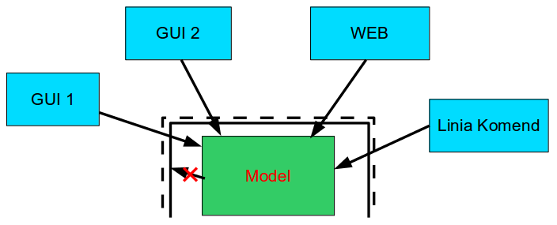
]

---

## Nie ma uniwersalnego wzorca projektowego

.img-top-right[

]

* Istnieje wiele wzorców
* Ustalmy do czego potrzebne nam są one potrzebne:
  * chcemy np. zrozumieć różne style architektoniczne
  * chcemy w zespole architektów i programistów posługiwać się wspólną terminologią
  * przecież nie chce nam się za każdym razem tłumaczyć jak odseparować prezentację :-)
  * chcemy szybko orientować się w strukturze istniejącego projektu poprzez ujednolicenie projektu implementacji
* Czynniki decydujące o wyborze konkretnego wzorca:
  * skala projektu
  * liczba deweloperów
  * stopień skomplikowania

???
Czynniki decydujące o wyborze konkretnego wzorca:
* skala projektu – dla małych projektów, których dalszy rozwój jest mało prawdopodobny powinniśmy stosować możliwie najprostsze wzorce projektowe, które wymagają jak najmniejszych nakładów;
* liczba deweloperów – dla średnich i dużych projektów z dużą liczbą programistów powinniśmy rozważyć wzorce projektowe umożliwiające elastyczny podziała na moduły, kontrolowanie wersji oraz współpracę części związanych z prezentacją czyli graficznym interfejsem użytkownika i pozostałych fragmentów aplikacji,
* stopień skomplikowania – dla mało skomplikowanych projektów nie warto stosować rozbudowanych i pracochłonnych wzorców;

---
# Wzorce projektowe - przykłady

.img-top-right[
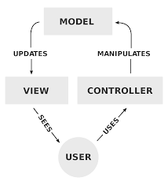
]

* Przykłady:  
  * Wzorzec singleton
  * Wzorzec fabryki i wiele innych...
  * Wzorzec (?) MVC – Model View Controller
    * przetrwał próbę czasu (ponad 35 lat, lata 70)
    * sprawdza się w separacji Logiki Biznesowej od Logiki Prezentacji.
    * stosuje się go zazwyczaj do rozwiązań bazodanowych, a nie do specjalistycznych aplikacji opartych na
    * technologii „bogaty klient” („rich client”)
---

## Wybrane wzorce implementacji interfejsu użytkownika

.ref[http://www.martinfowler.com/eaaDev/]

* Model – Widok – Kontroler (MVC) (osobny wzorzec projektowy czy raczej ich zbiór?)
* Model – Widok (np. Java oraz Qt w kontekście kontrolek)
* Zawiadomienie (Notification)
* Kontroler zarządzający (Supervising controller)
* Pasywny widok (Passive View)
* Model prezentacji (Presentation Model)
* Agregacja komunikatów (Event aggregator)
* Kontroler strony (Page controller)
* Synchronizacja stanu - sterująca (Flow Synchronization)
* Synchronizacja stanu - obserwująca (Observer Synchronization)
  * wariant z odpytywaniem
  * wariant z powiadomieniem
* Selektor prezentacji (Presentation Chooser)
* Oddzielona prezentacja (Separated Presentation)

---

## Synchronizacja stanów - aplikacja stacjonarna

.img-top-right[
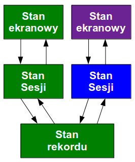
]

* Zazwyczaj dane dziedzinowe pochodzą z jakiejś bazy danych (SQL).
* W systemie dane te występują w trzech zasadniczych kopiach (stanach):
  1. **w rzeczywistej bazie na serwerze** (lub lokalnym pliku), kopię tę możemy nazwać stanem rekordu.
  2. **w pamięci operacyjnej** związanej z naszą aplikacją w postaci jakiegoś zbioru danych (RecordSet), którą nazwiemy stanem sesji.
  3. **na ekranie w komponentach GUI**, którą określimy stanem ekranowym.
* Jednym z kluczowych elementów architektury GUI jest synchronizacja danych pomiędzy stanami ekranowym i sesji.
* Wykorzystuje się do tego wbudowany w niektóre kontrolki mechanizm: DataBinding.

???
To zasadniczy problem.
---
## Databinding – w GUI

.img-top-right[
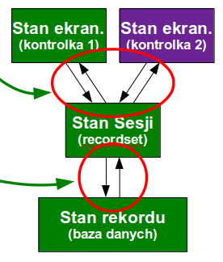
]

* Podstawowa idea – data binding zapewnia synchronizację między tym co znajduje się
na ekranie a tym co znajduje się w recordset'ie.
* Kontrolka jest podpięta do kolumny w tabeli lub kwerendzie zazwyczaj za pomocą
  pola atrybutu (property). Data binding może być rozbudowany o synchronizację
  z bazą danych (stan rekordu).
* Każda zmiana na ekranie automatycznie propaguje się do recordsetu i odwrotnie.
* Problem zapętlających się uaktualnień.
  * Koncepcja ładowania z sesji (RecordSet) do kontrolek tylko podczas pierwszego
    pokazywania.
  * Koncepcja obserwatorów.
* Większa część funkcjonalności związanej z Data Binding jest zaimplementowana
  w bibliotece, którą wykorzystujemy.

---

## Dawno, dawno temu, w odległej architekturze...

* Przykładowo w Delphi funkcjonował mechanizm DataBinding za pomocą kompontu `TDataSource`
.img-center-full[
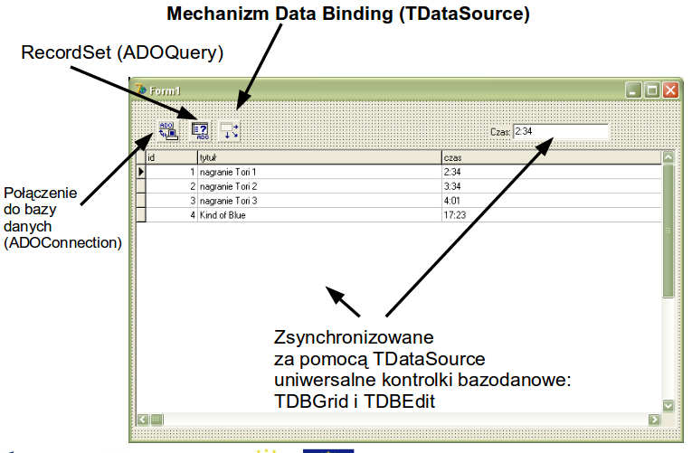
]

???
W rzeczywistości w Delphi komponent ten jest interfejsem między standardowymi kontrolkami
bazodanowymi a różnymi komponentami przechowującymi zbiory danych (TDataSet).
---
## Przykład 1: Formularze i Kontrolki

.ref[Martin Fowler, „Development of Further Patterns of Enterprise Application Architecture”]

.img-top-right[
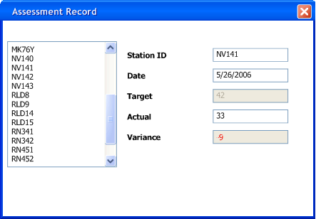
]

.smaller[
Architektura typu 'databinded vanilla' - programista używa standardowych kontrolek, które
są automatycznie podłączone (databinding) do struktury bazy danych i implementuje pełną logikę interfejsu w formularzu (*ang. Page/Form Controller*)
* Architektura promowana w latach 90-tych dla aplikacji klient-serwer głównie w narzędziach takich jak Visual Basic, Delphi czy PowerBuilder.
* Dość praktyczna podczas prototypowania (automatyczne zasilanie rzeczywistymi danymi), ze względu na natychmiastowe efekty.

* Program przykładowy:
  * Zbiór stacji pomiarowych pewnej wartości, raportujemy dla każdej stacji (elementy dziedzinowe):
    * wartość zmierzoną (Actual)
    * wartość progową (Target)  
  * tylko w interfejsie użytkownika prezentujemy dodatkowe informacje:
    * różnicę (Variance), która jest za każdym razem obliczana i  wyświetlana w trzech kolorach: zielonym, czarnym i czerwonym
]

---
## Zadania formularza
.img-top-right[

]

* Formularz (widok) jest specyficzny dla naszej aplikacji, ale używa pewnych ogólnych
kontrolek.
* Formularz jest odpowiedzialny za:
  * układ kontrolek na ekranie,
  * logikę formularza (widoku), która nie może być w łatwy sposób zrealizowana wewnątrz kontrolek.

---
## Specyficzne funkcje aplikacji

.img-top-right[
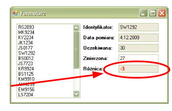
]

* Standardowe kontrolki nie udostępniają funkcjonalności, która jest związana z logiką naszej konkretnej aplikacji
* W naszym przypadku jest to logika związana z kolorem w jakim ma być wyświetlona różnica między wartościami zmierzonymi i zadanymi. W przypadku znacznych odchyłek ma być to kolor czerwony.

.smaller[
* Są dwa zasadnicze rozwiązania:
  1. za każdym razem gdy zmieni się wartość kontrolki różnicy, możemy informować o tym formularz (klasę widoku), który następnie pobierze aktualną wartość z kontrolki i na tej podstawie podejmie odpowiednią decyzję o kolorze. (Wzorzec GUI: Formularz i Kontrolka).
  Kontrolki udostępniają mechanizm zdarzeń (events), do których podpina się formularz. W takim rozwiązaniu formularz oczekuje na konkretne zdarzenia i posiada wiedzę jak na nie powinien poprawnie logicznie zareagować.
  2. tworzymy naszą własną kontrolkę, która rozszerza funkcjonalność kontrolki standardowej o dodatkową opcję związaną z kolorem (np. Qt). W tym przypadku kontrolka posiada wiedzę jak powinna poprawnie logicznie zareagować.
]
---
## Edycja z wykorzystaniem Form

.img-center-full[
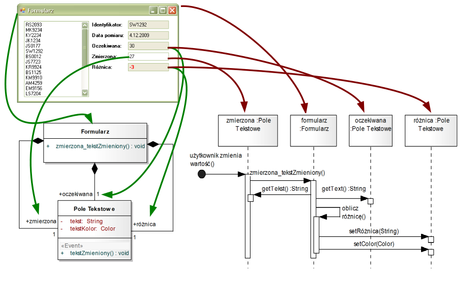
]

---
## Analiza – Formularz i Kontrolka

.img-top-right[

]

* Formularze (widoki) są specjalizowane dla naszej aplikacji, ale wykorzystują do tego uniwersalne kontrolki.
* Formularz definiuje układ kontrolek na ekranie.
* Proste edycje danych na ekranie są obsługiwane przez mechanizm Data Binding.
* Bardziej złożone modyfikacje są realizowane w metodach obsługi zdarzeń w formularzu.
* W tym celu formularz obserwuje kontrolki za pośrednictwem metod, które są połączone ze zdarzeniami generowanymi przez kontrolki.

Problemy:
* niska kontrola nad wydajnością ostatecznej wersji systemu (databinding oraz kontrola wydajności obliczeń związanych z logiką dziedziny aplikacji),
* problematyczne transakcje, wzajemne blokowanie (zakleszczenia),
* walidacja – gdzie ją zrealizować? (w formularzu, czy na etapie Data Bindingu)
* testy wymagają podłączenia do bazy danych lub stosowania zaślepek
---
## Wzorzec mvc

.smaller[
* **Model** (obiekty dziedziny)
  * Zarządza zachowaniem się danych w dziedzinie dla której została stworzona aplikacja.
  * Potrafi poinformować o swoim stanie.
  * Potrafi uaktualnić swój stan.
* **Widok**
  * Zajmuje się tylko wyświetlaniem informacji.
  * Ma wiedzę co trzeba wyświetlić i jak w danym momencie.
* **Kontroler**
  * Interpretuje zainicjowane akcje  oraz wprowadzone przez użytkownika dane.
  * Ma wiedzę potrzebną aby kontrolować sekwencje widoków.

*Uwaga! W aplikacji jest wiele par widok, kontroler.*
]

.first-column[
  .img-center[
  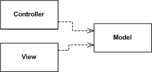
  ]
]
.second-column[
  .img-center[
  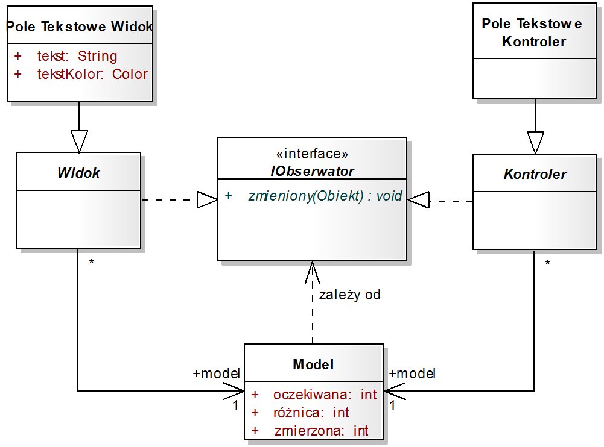
  ]
]
.third-column[
  .img-center[
  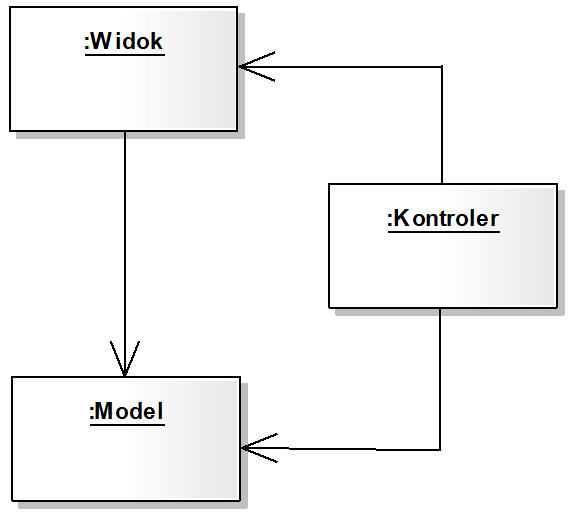
  ]
]
---

## Warianty implementacji MVC na różnych poziomach

Wzorzez MVC występuje w aplikacjach w wielu różnych wariantach i na różnych
poziomach aplikacji:

* Na poziomie kontrolek (każda kontrolka może mieć własny, (jakoś odseparowany!) kontroler)
* Na poziomie okien (każde okno ma własny kontroler - Page Controler)
* Na poziomie całej aplikacji (kontroler i elementy widoku są odseparowane np. w postaci osobnych komponentów)
  * Często wykorzystywane w klasycznych aplikacjach internetowych opartych na linkach z uwagi na odseparowanie jsp i html w postaci jakichś szablonów stron itp.
  * Tak działają systemy CMS umożliwiające nawigację między stronami z zapamiętywaniem filtrów np.
* Na poziomie całej aplikacji: Front Controller

Hmmmm,... jak to wszystko rozumieć? Zasadniczo MVC

---
## Dwie wersje MVC

.left-column[
.smaller[
Koncepcja sterującego kontrolera:
 * model jest elementem niezależnym
 * występuje zależność między kontrolerem a widokiem, który steruje widokiem (np. odświeżaniem, specyficznymi cechami, itp.)
]
]

.right-column[
.smaller[
  Tradycyjny model MVC:
  * model nadal niezależny
  * programista zazwyczaj nie używa bezpośrednio zależności między kontrolerem a widokiem, komunikację automatyzują różne wzorce mechanizmów, które informują widok o zmianach modelu
  * możliwa do praktycznej realizacji w przypadku aplikacji stacjonarnych
]
]

.clear[
]

.left-column[
.img-center[

]   
]

.right-column[
.img-center[

]

]
---
## MVC vs Architektura Warstwowa

.img-top-right[
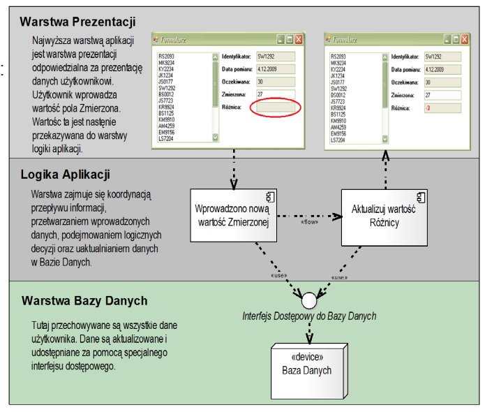
]
.smaller[
* Architektura warstwowa ma się nijak do MVC!
* Architektura warstwowa jest metodą separacji modułów systemu jako całości.
* MVC dotyczy tylko obsługi interfejsu użytkownika.
* MVC może być zrealizowane w architekturze warstwowej wtedy gdy kontroler jest
  elementem najwyższej warstwy.

* Koncepcja mylnie określana jako warstwowa pochodzi z lat 90 i nie do końca jest właściwa:
  * html – pasywna prezentacja, tylko wyświetlanie danych i pól formularzy
  * serwer aplikacji - centralny kontroler, interpretujący zapytania od przeglądarki,
    czyli pośrednio komendy użytkownika
  * baza danych (uwzględniając warstwę dostępu DAL), widziana tylko przez kontroler
    pośredniczący, który wstrzykuje 'Beany' do szablonu strony

* To jest właściwie MVC, i nie powinno się określać jako architekturę warstwową,
  ponieważ użytkownik nie jest w niej odseparowany od kontrolera przez logikę
  w HTMLu (oczywiście JavaScriptie)
]

---
## Tradycyjny model MVC

* Model wywodzi się ze Smalltalka (aplikacje stacjonarne).
* Zakładamy, że mamy kontrolki dedykowane do naszej aplikacji.
* Bardzo podobne do Data Binding, ale bez zdarzeń (events), oraz tym razem widok obserwuje model, a nie formularz obserwuje kontrolki. (wykorzystując wzorzec Obserwator)

.left-column[
  .img-center-full[
  .lb[]
  ]
]

.right-column[
  .img-center-full[
  .lb[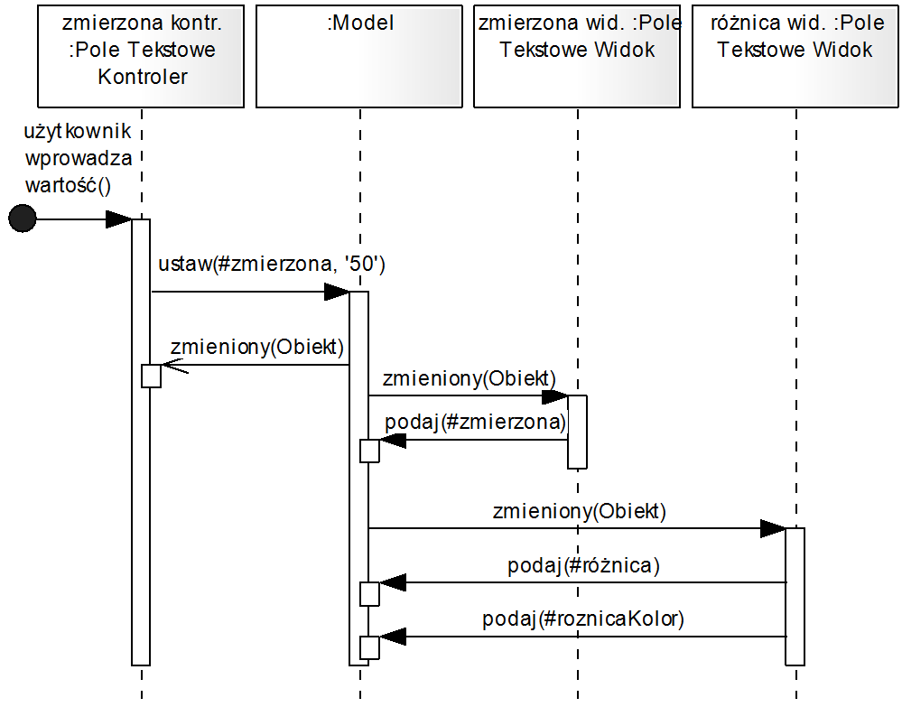]
  ]
]

---

## MVC - na poziomie kotrolek

Wykorzystując silnie obiektowość i dziedziczenie, w specjalistycznych
kontrolkach umieszczamy dodatkową funkcjonalność:

.img-right-wider[
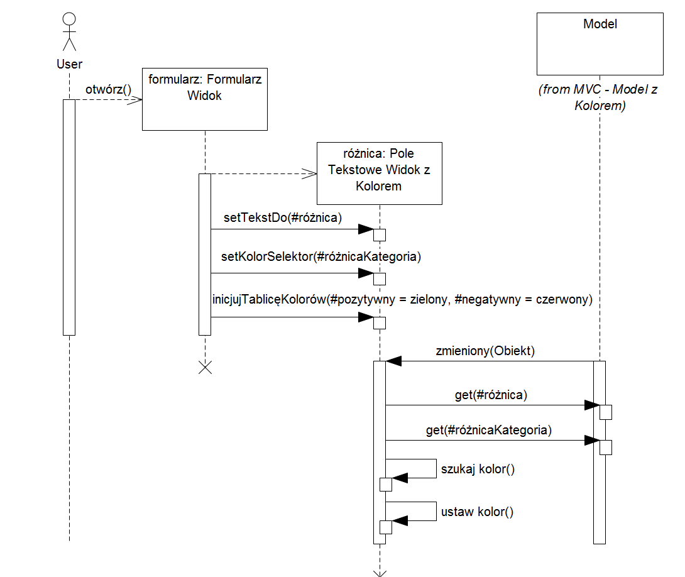
]

* Sposób prezentacji graficznej (kolor) przedstawiamy w postaci logicznej (kategoria)
* Dla tablicy kategorii przyporządkowujemy np. tablicę kolorów czcionki,
* w ten sposób model musi udostępniać dodatkową informację o nowym wskaźniku
---

## Pośredni model prezentacji

Tworzymy model dla widoku, czyli pewien obiekt tłumaczący wartości z dziedziny aplikacji na dziedzinę interfejsu użytkownika.

 * Model prezentacji przechowuje i udostępnia konkretne informacje związane bezpośrednio z interfejsem użytkownika: czyli np. kolor.
 * Centralizacja logiki.

.img-center[
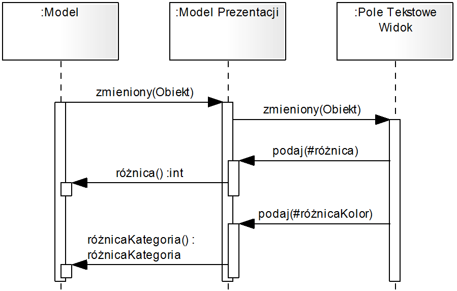
]

---

## Wzorzec powiadomieniem

Obiekt zbierający informacje o błędach lub innych wiadomościach związanych z dziedziną aplikacji, który następnie jest przekazywany do warstwy (modułu) prezentacji.
Moduł prezentacji następnie może wyświetlić odpowiednie komunikaty zawarte w obiekcie Notification.
W najprostszej postaci Notification jest zbiorem napisów.
Kiedy używać? Np. w przypadku gdy walidacja wykonywana jest warstwie, która nie ma dostępu do prezentacji.

---

## Kontroler nadzorujący (ang. supervising controller)

* Wzorzec wykorzystuje kontroler do obsługi komunikatów pochodzących od użytkownika (koncepcja klasyczna), oraz do obsługi złożonej logiki prezentacji (w naszym przypadku do określenia koloru).
* Przydatny przy tworzeniu testów automatycznych. (Tylko skomplikowana logika)

.left-column[
  .img-center-full[
  .lb[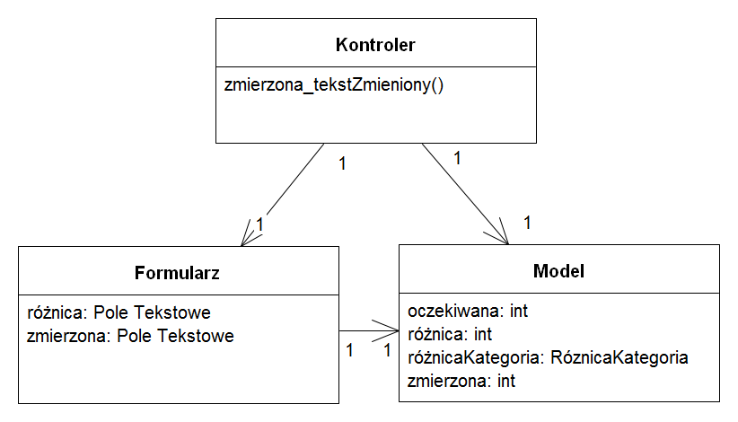]
  ]
]

.right-column[  
  .img-center-full[
  .lb[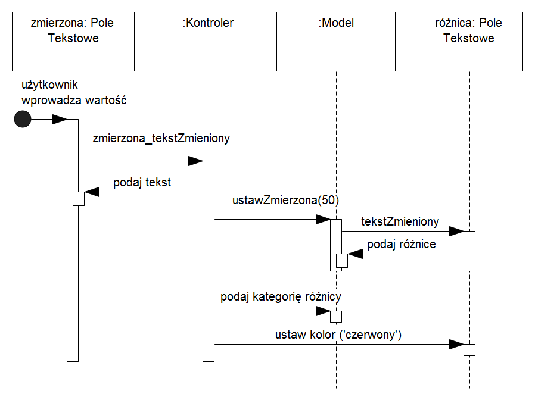]
  ]
]

---
## Widok pasywny (ang. passive view)

* Cała funkcjonalność: reakcja na komunikaty użytkownika i zarządzanie prezentacją włącznie z logiką aplikacji specyficzną dla dziedziny jest realizowana przez kontroler.
* Najczęściej stosowany w aplikacjach typu rich client ze względu na możliwość stworzenia automatycznych testów.

.left-column[
  .img-center-full[
  .lb[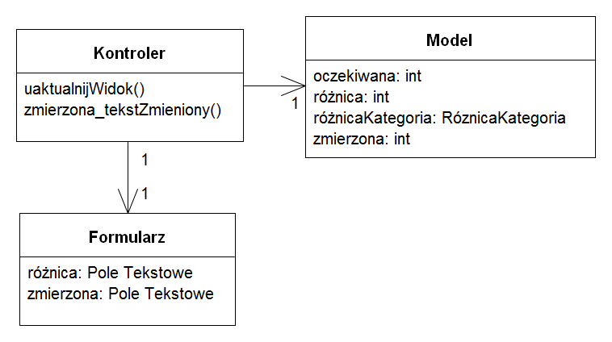]
  ]
]

.right-column[  
  .img-center-full[
  .lb[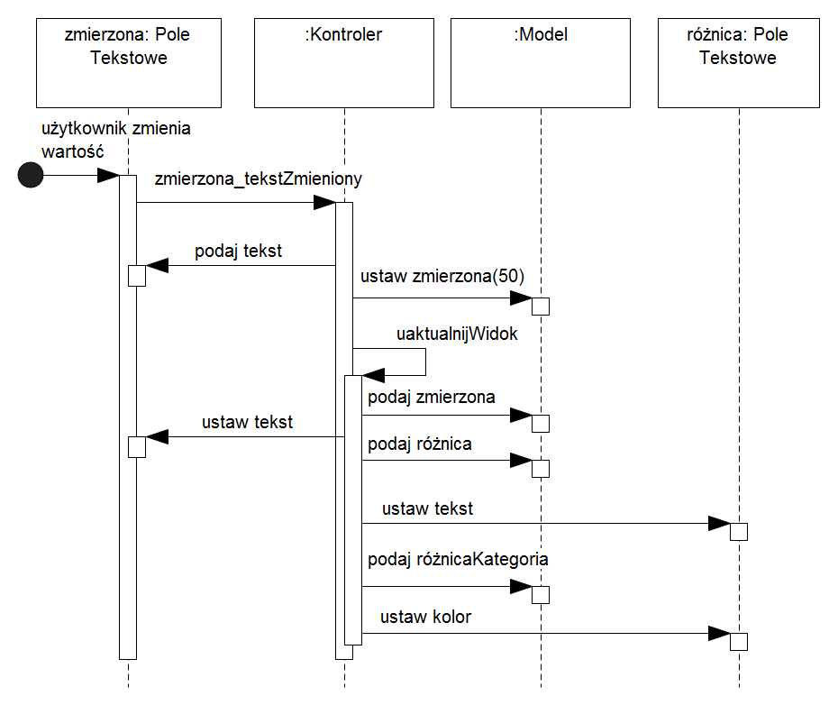]
  ]
]

---

## Model prezentacji (ang. presentation model)

* Umożliwia reprezentację stanu i zachowania prezentacji niezależnie od kontrolek GUI używanych na ekranie.
* Oznacza, to że stan ekranu nie znajduje się w kontrolkach lecz w modelu.
* Model prezentacji może odwoływać się do wielu obiektów dziedziny aplikacji. Nie jest zatem fasadą obiektów dziedziny
* Model prezentacji można uznać za pewną 'abstrakcję' niezależną od platformy GUI (GUI framework)

.img-center[
.lb[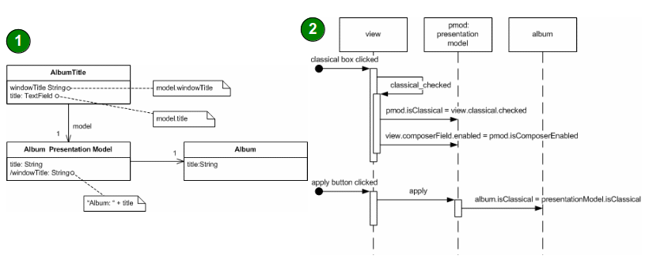]
]

---

## Synchronizacja widoków

* Używany w sytuacjach gdy w kilku widokach pokazujemy dane pochodzące z tego samego źródła.
* Jeżeli na jednym ekranie użytkownik zmieni wartość jakiegoś pola wówczas formularz uaktualnia kopię sesji (czyli np. Recordset), a następnie samodzielnie wymusza na pozostałych oknach, które pokazują tą samą informację aby się odświeżyły.
* Dwie strategie:
 * Synchronizacja obserwująca - obserwacja stanu nadrzędnego w Modelu, albo w Recordsetie, albo rejestracja w centralnym wzorcu powiadomień
 * Wprowadzenie bezpośrednich zależności między komponentami

---

## Selektor prezentacji (fabryka prezentacji)

.img-top-right[
.lb[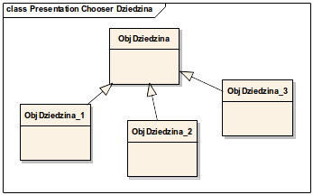]
]

* Wybiera komponent odpowiedni dla konkretnego obiektu z dziedziny aplikacji.
* Stosowany w sytuacji, gdy w danym momencie musimy wyświetlić różne komponenty dla różnych aktualnie wybranych obiektów.

.img-center-small[
.lb[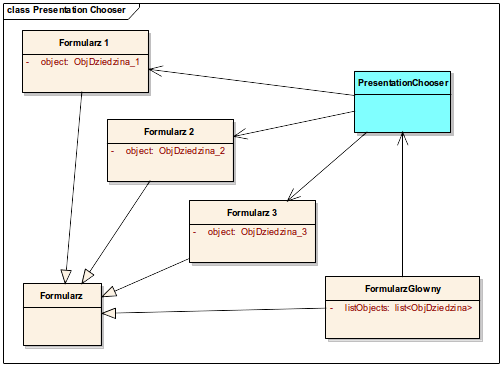]
]

---

## Kontroler pośredniczący (ang. front controller)

* Zadaniem głównego kontrolera jest interpretacja akcji, użycie stosownego
  obiektu obsługującego akcję, oraz wyświetlenie strony na podstawie
  zwróconego kodu strony.

.img-center[
.lb[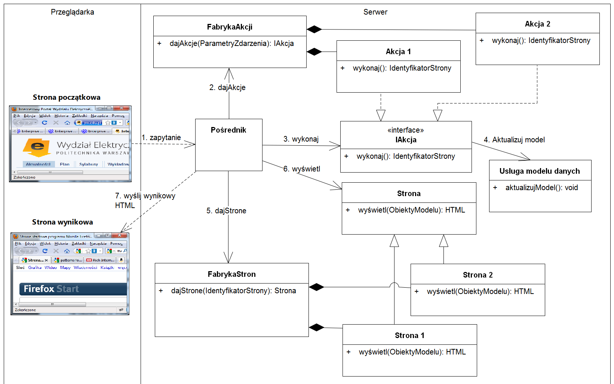]
]

---

## Front Controller – Wady i Zalety

* Zalety:
  * Większa elastyczność (np. poprzez plik konfiguracyjny oraz fabrykę komend)
  * Uproszczone widoki (bez obsługi akcji)
  * Gotowe na rozbudowę i modyfikacje
  * Mapowanie URL (ukrycie nazw stron przed użytkownikiem, czego brakuje w wzorcu Page Controller)
  * Bezpieczeństwo wątkowe
* Wady:
  * Obniżona wydajność
  * Zwiększone skomplikowanie kodu, pogorszona czytelność i odkrywalność, stroma krzywa tworzenia aplikacji wymagająca dużych nakładów na początku
  * Front Controller jest zaimplementowany w ASP.NET (IHTTPHandler) – trudne testowanie w oddzieleniu od serwera aplikacji
  * Utrudnione śledzenie stanu aplikacji, ponieważ Front Controller decyduje o przepływie stron, te same adresy URL mogą prowadzić do różnych stron (utrudnione np. wyświetlanie stron zapamiętanych w ulubionych)

---
.center[
# Thank you]
