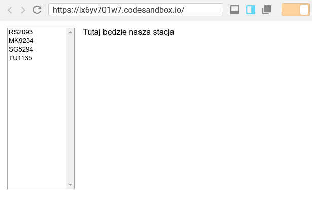
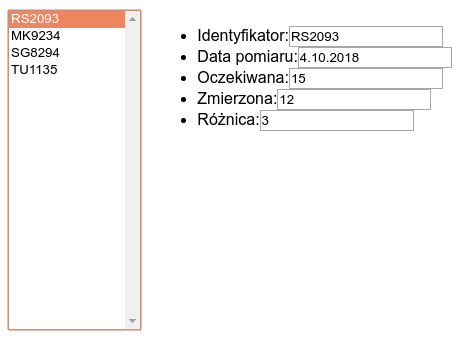
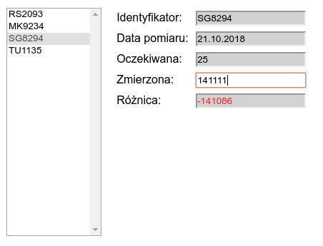

class: center, middle, inverse

# Projektowanie graficznych interfejsów użytkownika
## Wykład 5 - Hands on - Wzorce projektowe w Reactie
## Robert Szmurło
e-mail: robert.szmurlo@ee.pw.edu.pl
2018Z

---
# Plan działania

.img-top-right[

]

* Zaimplementujemy wybrane wzorce utrzymania stanu w Reactie

* UWAGA! Będziemy naginać Reacta i działać wbrew jego naturze i zalecanym
  do realizacji w nim wzorcom, ale...
  * będziemy o tym wspominać
  * dzięki temu głębiej zrozumiemy ogólnie wzorce projektowego
  * głębiej zrozumiemy samego Reacta

---
## Wzorzec - Kontrolujący formularz

Komponent reprezentujący formularz będzie przechowywał stan, oraz reagował na zmiany.

.img-center-full[

]

---
class: animated, bounceInRight

## Analiza – Kontrolujący formularz

.img-top-right[

]

* Formularze (widoki) są specjalizowane dla naszej aplikacji, ale wykorzystują do tego uniwersalne kontrolki.
* Formularz definiuje układ kontrolek na ekranie.
* Proste edycje danych na ekranie są obsługiwane przez mechanizm Data Binding.
* Bardziej złożone modyfikacje są realizowane w metodach obsługi zdarzeń w formularzu.
* W tym celu formularz obserwuje kontrolki za pośrednictwem metod, które są połączone ze zdarzeniami generowanymi przez kontrolki.

Problemy:
* niska kontrola nad wydajnością ostatecznej wersji systemu (databinding oraz kontrola wydajności obliczeń związanych z logiką dziedziny aplikacji),
* problematyczne transakcje, wzajemne blokowanie (zakleszczenia),
* walidacja – gdzie ją zrealizować? (w formularzu, czy na etapie Data Bindingu)
* testy wymagają podłączenia do bazy danych lub stosowania zaślepek

---
class: animated, bounceInRight

## Zaczynamy od szkieletu aplikacji i danych

.left-column[
Utwórzmy plik `data.js` i wypełnijmy go przykładowymi danymi:
]

.right-column[
```javascript
// data.js
export var DataSet = {
  stations: [
    {
      id: 1,
      name: "RS2093",
      date: "4.10.2018",
      value: 12,
      expected: 15
    },
    {
      id: 2,
      name: "MK9234",
      date: "15.08.2018",
      value: 13,
      expected: 10
    },
    {
      id: 3,
      name: "SG8294",
      date: "21.10.2018",
      value: 14,
      expected: 25
    },
    {
      id: 4,
      name: "TU1135",
      date: "2.09.2018",
      value: 15,
      expected: 50
    }
  ]
};
```
]

---
class: animated, flipInY

## Tworzymy szkielet główny aplikacji

.left-column[
.small-code[
```javascript
//index.js
import { DataSet } from "./data.js";

class App extends React.Component {
  constructor(props) {
    super(props);
    this.state = {
      data: DataSet,
      selected: undefined
    };
  }

  render() {
    return (
      <div className="App">
        <div className="left">
          <select
            className="stations"
            name="stations"
            multiple
          >
            {this.state.data.stations.map(s => {
              return (
                <option key={s.id} value={s.id}>
                  {s.name}
                </option>
              );
            })}
          </select>
        </div>
        <div className="right">
          Tutaj będzie nasza stacja
        </div>
      </div>
    );
  }
}
```
]
]

.right-column[
Po minimalny ostylowaniu:
.small-code[
```CSS
.App {
  font-family: sans-serif;
  width: 32em;
  height: 20em;
}
select.stations {
  width: 10em;
  height: 100%;
}
.left {
  float: left;
  height: 100%;
  padding: 0.5em;
}
.right {
  float: left;
  height: 100%;
  padding: 0.5em;
}
```
Pojawia się układ:
.img-center-full[
.lb[]
]
]

]
---

## W kolejnym etapie komponent do wyświetlania stacji

.small-code[
```JavaScript
class Station extends React.Component {
  constructor(props) {
    super(props);
    let s = props.station;
  }
  render() {
    var s = this.props.station;
    return (
      <div className="details">
        <form>
          <ul>
            <li><span>Identyfikator:</span>
                <span><input type="text" readOnly value={s.name} /></span>
            </li>
            <li><span>Data pomiaru:</span>
                <span><input type="text" readOnly value={s.date} /></span>
            </li>
            <li><span>Oczekiwana:</span>
                <span><input type="text" readOnly value={s.expected} /></span>
            </li>
            <li><span>Zmierzona:</span>
                <span><input type="text" value={s.value} /></span>
            </li>
            <li><span>Różnica:</span>
                <span><input type="text" readOnly value={s.variance} /></span>
            </li>
          </ul>
        </form>
      </div>
    );
  }
}
```
]
--
.img-center-over[
.lb[]
]

---

## Reagujemy na zmianę stacji na liście

.left-column[
.small-code[
```html
<select className="stations"
  name="stations" onChange={this.selected}
  multiple>
  {this.state.data.stations.map(s => {
    return (
      <option key={s.id} value={s.id}>
        {s.name}
      </option>
    );
  })}
</select>
```
]
Dodajmy jeszcze style:
.small-code[
```css
.details ul {
  padding-left: 0;
  padding-top: 0;
  margin-top: 0;
  display: table;
}
.details li {
  display: table-row;
}
.details li > span {
  display: table-cell;
  padding: 0.3em;
}
input:read-only {
  background-color: lightgrey;
}
.critical {
  color: red;
}
```
]
]
.right-column[
```JavaScript
selected = e => {
  var selected = undefined;
  var k = e.target.value;
  for (var idx in this.state.data.stations) {
    var s = this.state.data.stations[idx];
    if (s.id == parseInt(k)) {
      selected = s;
      break;
    }
  }
  this.setState({
    selected: selected
  });
};
```
.img-center-full[
.lb[]
]
]
---

## Kolorujemy przy zmianie wartości oraz pierwszym wyświetleniu

.left-column[
.small-code[
```JavaScript
constructor(props) {
  super(props);
  let s = props.station;
  this.state = {
    variance: s.expected - s.value,
    value: s.value,
    color: s.value > s.expected ? "critical" : "auto"
  };
}

componentWillReceiveProps(nextProps) {
  let s = nextProps.station;
  this.state.value = s.value;
  this.state.variance = s.expected - this.state.value;
  this.state.color = s.value > s.expected ? "critical" : "auto";
}

onChangedValue = e => {
  var v = e.target.value;
  let s = this.props.station;
  this.setState({
    value: v,
    variance: s.expected - v,
    color: v > s.expected ? "critical" : "auto"
  });
};
```
]
]

.right-column[
.small-code[
```JavaScript
<li>
  <span>Zmierzona:</span>
  <span>
    <input
      type="text"
      value={s.value}
      value={this.state.value}
      onChange={this.onChangedValue}
    />
  </span>
</li>
<li>
  <span>Różnica:</span>
  <span>
    <input
      type="text"
      readOnly
      className={this.state.color}
      readOnly
      value={this.state.variance}
    />
  </span>
</li>
```            
]
.img-center-small[
.lb[]
]
]
---
## Wersja z referencją do obiektu DOM (różnicy)

* Teraz zrobimy inną wersję, utworzymy metody komponentu,
  które będą bezpośrednio modyfikować element DOM
* Bedziemy bezpośrednio sutawiać kolor za pomocą:

```javascript
variance.className = v < 0 ? "critical" : "auto";
```  

Drobna modyfikacja htmla:

```HTML
<li>
  <span>Różnica:</span>
  <span>
    <input
*     ref={this.refVariance}
      type="text"
      readOnly
      value={this.state.variance}
    />
    {/*className={this.state.color}*/}
  </span>
</li>
```  
---
## Wersja z referencją do obiektu DOM (różnicy)

.small-code[
```JavaScript
class Station extends React.Component {
  constructor(props) {
    super(props);
    let s = props.station;
    this.state = {
      variance: s.expected - s.value,
      value: s.value
    };
    this.refVariance = React.createRef();
  }

  componentWillReceiveProps(nextProps) {
    let s = nextProps.station;
    this.state.value = s.value;
    this.state.variance = s.expected - this.state.value;
    this.updateColor(s.expected - s.value);
  }

  onChangedValue = e => {
    var v = e.target.value;
    let s = this.props.station;
    this.setState({
      value: v,
      variance: s.expected - v
    });
    this.updateColor(s.expected - v);
  };

  componentDidMount() {
    this.updateColor(this.props.station.expected - this.state.value);
  }

  updateColor(v) {
    let variance = this.refVariance.current;
    variance.className = v < 0 ? "critical" : "auto";
  }
  ...
}
```
]


---
## Prosty model prezentacji

Ideą jest przeniesienie obsługi danych do oddzielnej klasy. Trochę to 'boilerplate',
ale jego zalety można poznac przy testach i poprawionej czytelności kodu.

```JavaScript
class StationViewModel {
  constructor(station) {
    // CLONE
    this.station = { ...station };
  }

  setValue(newValue) {
    this.station.value = newValue;
  }

  getValue() {
    return this.station.value;
  }

  setStation(s) {
    // CLONE
    this.station = { ...s };
  }

  getColorClass() {
    let s = this.station;
    return s.value > s.expected ? "critical" : "auto";
  }

  getVariance() {
    let s = this.station;
    return s.expected - s.value;
  }
}
```

---
## Teraz użyjemy model prezentacji

```JavaScript
class Station extends React.Component {
  constructor(props) {
    super(props);
    let s = props.station;
    this.state = {
      model: new StationViewModel(s)
    };
    this.refVariance = React.createRef();
  }

  componentWillReceiveProps(nextProps) {
    // this.setState(state => {
    //   state.model.setStation(nextProps.station);
    //   return state;
    // });
    this.setState(state => {
      state.model = new StationViewModel(nextProps.station);
      return state;
    });
  }

  onChangedValue = e => {
    var v = e.target.value;
    this.setState(state => {
      state.model.setValue(parseInt(v, 10));
      return state;
    });
  };
}
```
---
### I jeszcze zmienimy referencje

```HTML
<li>
  <span>Zmierzona:</span>
  <span>
    <input
      type="text"
*      value={this.state.model.getValue()}
      onChange={this.onChangedValue}
    />
  </span>
</li>
<li>
  <span>Różnica:</span>
  <span>
    <input
      ref={this.refVariance}
      type="text"
      readOnly
*      value={this.state.model.getVariance()}
*      className={this.state.model.getColorClass()}
    />
  </span>
</li>
```
---
.center[
# Thank you]
